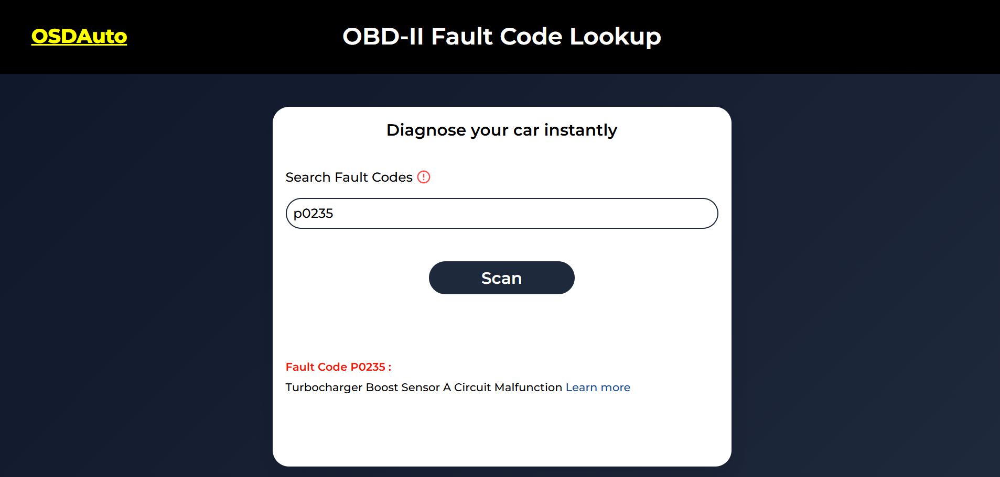

# OBD-II Code Lookup Tool

A web-based tool for searching and understanding OBD-II diagnostic trouble codes. This project helps users quickly find meanings of error codes used in vehicle diagnostics.

---

## Live Demo

👉 https://oussama-dalhi.github.io/obdcode-lockup/

---

## Features

* 🔍 Search OBD-II error codes (e.g., P0420, P0300)
* 📖 Display code descriptions and meanings
* ⚡ Fast lookup using local JSON data
* 🧠 Simple and intuitive user interface
* 📱 Lightweight and responsive design

---

## What This Project Demonstrates

* Working with **JSON data**
* Building a **search/filter system**
* DOM manipulation and dynamic rendering
* Handling user input efficiently
* Structuring a small data-driven application

---

## Tech Stack

* HTML5
* CSS3
* JavaScript (ES6+)

---

## 📂 Project Structure

```plaintext id="obd12x"
.
├── index.html
├── README.md
└── src/
    ├── codes.json
    ├── script.js
    └── style.css
```

---

## ⚙️ Getting Started

```bash id="obd98x"
git clone https://github.com/oussama-dalhi/obdcode-lockup.git
cd obdcode-lockup
```

Open `index.html` in your browser.

---

## 📸 Screenshots


---

##  Future Improvements

* 🏷️ Filter by code category (P, B, C, U)
* 📚 Add more detailed explanations and fixes
* 🌐 Multi-language support
* 📱 Improve mobile UX
* 🔎 Autocomplete search suggestions

---

## ⚠️ Disclaimer

This tool provides general information about OBD-II codes.
It should not replace professional vehicle diagnostics.

---
📈 Future Improvements
  . Add real-time API integration with OBD devices
  . Show more detailed diagnostics
  . Multi-language support
  . Advanced filtering system
  . Contributing

Contributions are welcome! Feel free to fork the repo and submit a pull request.

---
## Acknowledgements

* OBD-II code references and datasets
* Built as part of learning JavaScript and real-world applications

---

